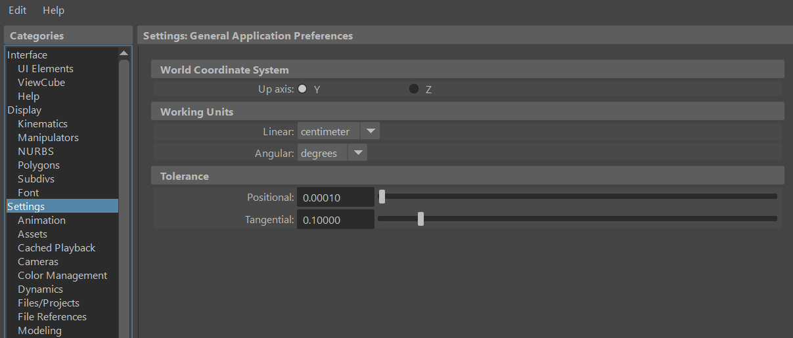
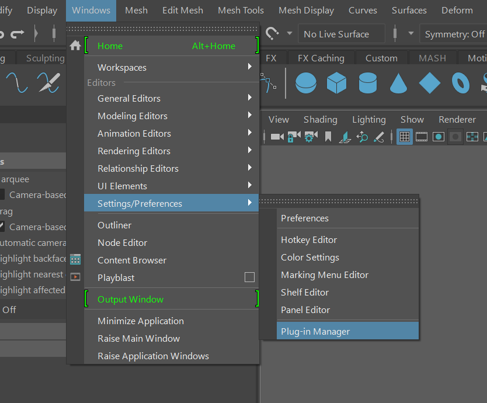
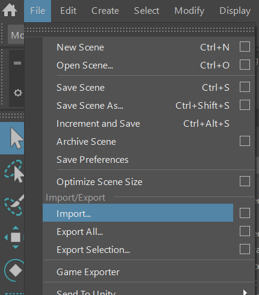
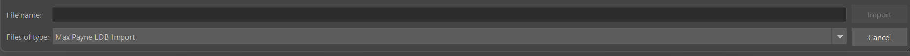

# Max Payne LDB Importer
Max Payne 1 LDB (Game levels) files importer plugin for Maya 2022


# Prerequisites:

You will need:
- Maya 2022 with Python 3 support

# Maya Configuration:

- Go to Maya's menu ```Windows > Settigns/Preferences > Preferences```
- Set ```Up axis``` to ```Y```
- Set ```Working Units``` to ```centimeter```


# Installation:

To install, first install ```Pillow``` using the [Maya's Python 3 interpreter](https://knowledge.autodesk.com/support/maya/learn-explore/caas/CloudHelp/cloudhelp/2022/ENU/Maya-Scripting/files/GUID-D64ACA64-2566-42B3-BE0F-BCE843A1702F-htm.html)
```bash
$> ./mayapy -m pip install Pillow
```

Put the ```max_payne_sdk_ldb_importer.py``` file into the ```plug-ins``` directory:

Windows:

```
C:\Users\<username>\Documents\maya\<version>\plug-ins\
```

Mac OSX:

```
/Users/Shared/Autodesk/maya/<version>/plug-ins/
```

Linux:

```
/home/<username>/maya/<version>/plug-ins/
```

Put the ```max_payne_sdk``` directory into the ```scripts``` directory:

Windows:

```
C:\Users\<username>\Documents\maya\<version>\scripts\
```

Mac OSX:

```
/Users/Shared/Autodesk/maya/<version>/scripts/
```

Linux:

```
/home/<username>/maya/<version>/scripts/
```

Start Maya and enable the plugin:




# Import:

- Go to Maya's menu ```File > Import...```
- Select ```Max Payne LDB Import```



